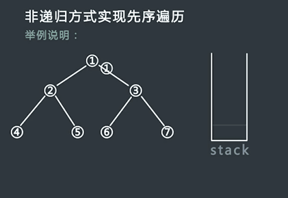
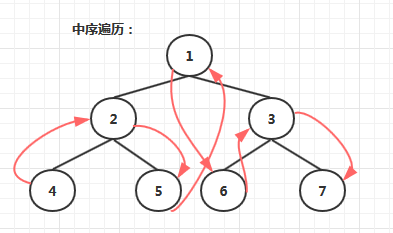
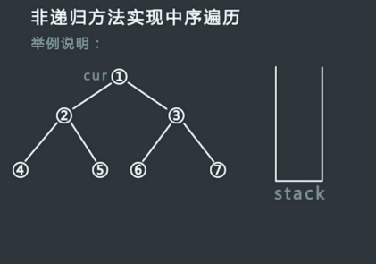
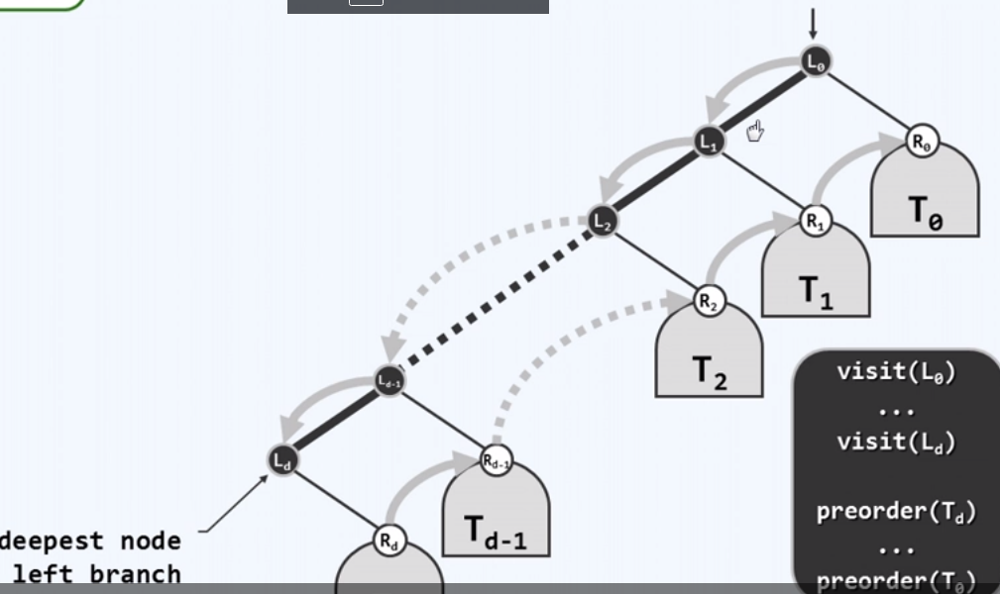
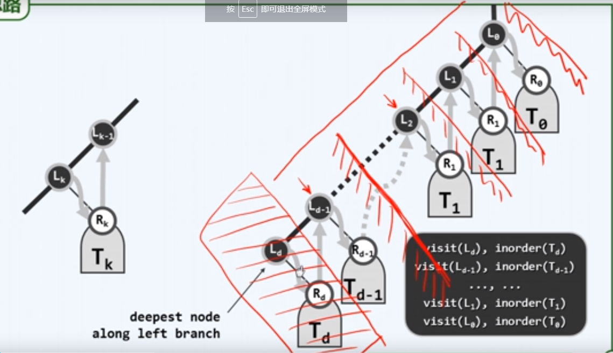

二叉树的遍历

首先需要记住两句话

1. **根节点的访问位置决定遍历方法**

2. **左永远在右的左边**，**右边永远在左边的右边**

遍历方法：

1. 深度优先：前序、中序、后序
2. 广度优先


**前序**：**1** 2 4 5 8 9 3 6 10 7 11 12

**中序**：4 2 8 5 9 **1** 6 10 3 11 7 12

**后序**：4 8 9 5 2 10 6 11 12 7 3 **1**

一、**先序**

​																


1. 第一种写法：

   **这种写法是先把左边全丢入栈，再看右边**

   ```c++
   void DLR1(TreeNode * root){ 
       if(root == NULL)
           return ;  
       TreeNode* node = root;  //记录当前结点
       stack<TreeNode*>treeStack;  //用栈来存访问过的结点，因为后面要用存储的结点来访问右子树
       //遍历整个树
       while((node != NULL) || (treeStack.empty() != true)){ //结点为空，栈为空。只要这两件事不同时发生就可以继续
           // 把左边结点放入栈
           while(node != NULL){ //这段代码负责向左 /
               printNode(*node);  //访问树结点的操作，这里定义为打印结点值
               treeStack.push(node);
               node = node -> left;
           } // 这里node一定是最左结点（相对）
           /*这里要做两件事：
           1.当前结点的右子树根节点准备丢入栈 
           2. pop()到当前结点的父结点，以便当前结点平行的右子树（即，父结点的右子树）访问完成，可以对父结点的右子树进行操作*/
           if(treeStack.empty() != true){  /*    这段代码负责向右  \                 */
               node = treeStack.top();  // note 与栈顶同步，pop之后，该栈顶会消失，如果不记录则无法获取其右子树
               node = node -> right;  //当前结点设置为右结点，准备往栈里丢
               treeStack.pop();          
           }
       }
   }
   ```

2. 第二种写法：

   **栈顶是当前结点**，**其入栈操作（打印）之后就要pop之**，**再依次压入其右子树（后访问）和左子树（先访问，位于栈顶）**

   ```c++
   void DLR2(TreeNode* root){
       TreeNode* current_node;  //记录当前栈top
       stack<TreeNode*>treeStack;
       treeStack.push(root);
       while(treeStack.empty() != true){
           current_node = treeStack.top(); // 当前结点
           printNode(*current_node);
           treeStack.pop();  //访问当前结点之后pop之
   
           if(current_node -> right != NULL){ // 先push右子树（后访问）
               treeStack.push(current_node -> right);
           }
   
           if(current_node -> left != NULL){ // 再push左子树（先访问）
               treeStack.push(current_node -> left);
           }
       }
   }
   ```

   

------

二、中序



跟先序一样，只是对结点进行操作（打印）的位置不一样

```c++
void LDR(TreeNode* root){
    TreeNode* current_node = root;
    stack<TreeNode*>treeStack;
    while((current_node != NULL) || (treeStack.empty() != true)){
        while(current_node != NULL){
            treeStack.push(current_node);
            current_node = current_node ->left;
        }
        if(treeStack.empty() != true){
            current_node = treeStack.top();
            printNode(*current_node); //这里对左边结点处理
            treeStack.pop();
            current_node = current_node -> right;
        }
    }
}
```



三、后序

左子树和右子树的访问都要借助根结点，并且右子树游历结束要pop并执行打印操作，所以每个栈元素都要有一个标记，当前是在其左子树分支还是右子树分支。


```c++
void LRD(TreeNode* root){
    TreeNode* current_node = root;  // 此指针游历整个树
    stack<TreeNode*>treeStack;
    stack<bool>flagStack;  // false表示从当前结点访问左结点

    while((treeStack.empty() != true) || (current_node != NULL)){
        while(current_node != NULL){
            treeStack.push(current_node);
            current_node = current_node -> left;
            flagStack.push(false);
        }

        if((treeStack.empty() != true) && flagStack.top()){
            if(flagStack.top()){
                printNode(*treeStack.top());
                treeStack.pop();
                flagStack.pop(); 
            }else{
                current_node = treeStack.top();
                current_node = current_node -> right;  
                flagStack.top() = true;
            } // 1.如果游历到右结点为空，栈不再push()新的结点，根据top标志true，
             //    说明此时借根结点游历右结点完毕，下一步就要pop(),同时打印操作
            // 2.如果游历到右结点不为空，栈会把右结点（右子树）push进去，
           //   根据top标志false,说明此时借根结点先游历左结点,先不进行pop操作
        }

        if(current_node == NULL ){
            cout<<"current_node is null"<<endl;
        }else{
            cout<<"current_node is "<<current_node -> val<<endl;
        }
    }
}
```

四、**总结**

因为左边永远在右边的左边，所以都要先把左边入栈。

先序，每个结点入栈的时候进行打印。

中序，从左结点回到根节点时，要pop根结点，此时执行打印操作，即此时访问了根节点。然后借助根节点访问右结点。

后序，从左结点回到根节点时，不能pop,因为还要借助根节点访问右子树，而且是右结点访问结束之后还要访问根节点。从右子树回到根节点时，要执行pop，同时执行打印操作，表示此时真正访问根节点。


**先序遍历宏观结构：对于每个子树，沿着左侧链条依次访问结点，然后再反向访问各个结点的右子树**



所以整个算法可以认为是不断丢入子树，让其进行上述例程。因此，先写出上述例程的算法：

``````c++
void visitAlongLeftBranch(treeNode *node, stack<treeNode*>&s){//沿着左链访问
    treeNode *leftNode=node;
    while(leftNode != NULL){
        visit(leftNode);
        s.push(leftNode->right);//左链结点依次入栈 ，不必排除空右子树
        leftNode = leftNode->left;
    }
}
``````

那么主算法就是不断丢入子树的循环了：

``````c++
void preOder2(treeNode *root){
    stack<treeNode*>s;
    treeNode*childN = root; //整个树
    while(true){
        visitAlongLeftBranch(childN, s); //例程
        if(s.empty()) break;
        childN = s.top();  s.pop(); //子树
    }
}
``````

**中序遍历宏观理解：对于每一个子树，都是沿着左侧链依次谦让访问权，直到最左边结点获得访问权执访问，然后再将访问权交给其右子树，再进行上述谦让。**



每个子树进行的例程如下，不断谦让入栈，但无访问权：

```c++
void goAlongLeftBranck(treeNode* node, stack<treeNode*>&s){
    treeNode*curr = node; 
    while(curr != NULL){ s.push(curr); curr = curr->left;}
}
```

主算法，不断丢入子树，访问左侧链最左边结点：

``````c++
void midOder(treeNode*root){
    treeNode*childN = root; 
    stack<treeNode*>s;
    while(true){
        goAlongLeftBranck(childN, s);
        if(s.empty()) break;
        visit(s.top()); childN = (s.top())->right;//访问最左结点，递交访问控制权只右子树
        s.pop();
    }
}
``````

**后序遍历宏观理解，抽象模型和上述相似，先将访问权交给最左结点的右子树，右子树访问完毕，再访问最左结点。需要定义好什么叫右子树访问完毕？1.右子树为空2.右子树不为空，右子树根节点已经被访问。所以还需要维护另外一个栈，来标识左侧链结点的右子树是否访问完毕。如何来说明第二种情况？当前栈顶的元素和上次pop的元素呈现父-右孩子关系时，说明当前栈顶的结点右子树已经被访问结束了**

每个子树的例程如下，不断向左谦让入栈，并构造标识右子树是否访问完毕的栈：

``````c++
void goAlongLeftBranchDs(treeNode*node, stack<treeNode*>&lb_s, stack<bool>&rc_s){
    treeNode*curr = node;
    while(curr != NULL){
        lb_s.push(curr); 
        (curr->right == NULL ) ? rc_s.push(true) : rc_s.push(false);
        curr = curr->left;
    }
}
``````

主算法，不断丢入子树，针对栈顶的结点，只有其右子树访问完毕，其才获得访问权执行访问：

``````c++
void postOrder(treeNode*root){
    treeNode*childN = root;
    treeNode*topNode;
    stack<treeNode*>lb_s;
    stack<bool>rc_s;
    while(true){
        goAlongLeftBranchDs(childN, lb_s,rc_s);
        if(rc_s.top() == true){
            topNode = lb_s.top();
            visit(topNode);lb_s.pop();rc_s.pop();
            if(lb_s.empty() && rc_s.empty()) break;
            if(topNode == lb_s.top()->right) {rc_s.top()=true;childN=NULL;continue;}
        }
        childN = lb_s.top()->right;
    }
}
``````

