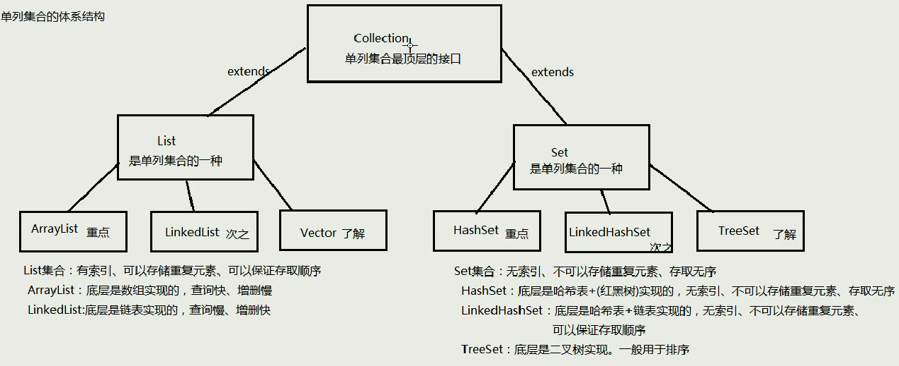

#### 一、集合

数组可以存储基本类型数据，也可以存储**相同类型**对象，长度不变；集合只能存储对象，默认Object类型，集合长度可变。



##### 1、顶层Collection接口

* `boolean add(E e)`			向集合中添加元素
* `boolean remove(E e)`删除集合中的某个元素
* `void clear()`清空集合所有元素
* `boolean contains(E e)`判断集合中是否包含某个元素
* `int size()`返回集合长度
* `Object[] toArray()`将集合转换为一个数组

##### 2、Iterator迭代器

获取`Collenction`集合元素的通用方式，是一个接口

两个常用的方法：

* `boolean hasNext()`判断集合中是否还有下一个元素，有返回`true`
* `E next()`返回迭代的下一个元素

```java
Collection<String> c = new ArrayList<>();
c.add("afda");
c.add("dgfh");
c.add("yuio");
Iterator<String>it = c.iterator();//获取迭代器
while(it.hasNext()){
	String e = it.next();
}
```

初始化一个迭代器，实际上是把一个指针指向容器的-1位置，每次调用`next`就把指针移动到下一个元素位置

##### 3、增强for循环

底层使用迭代器，简化代码书写。单列集合都可以使用，因为其实现了`Iterator<T>`接口。遍历集合和数组

```java
for(类型名 变量名：集合名/数组名){
	sout(变量名);
}
```

#### 二、泛型

可以再类、方法、接口中使用泛型

##### 1、含有泛型的类

```java
class ArrayList<E>{ 
    public boolean add(E e){ }

    public E get(int index){ }
   	....
}
```

##### 2、含有泛型的方法

```java
public class Demo04Main {
    public static void main(String[] args) {
        ArrayList<String>list1 = new ArrayList<>();
        ArrayList<Integer>list2 = new ArrayList<>();
        list1.add("dfa");
        list1.add("ojlk");
        list2.add(1);
        list2.add(23);
        printArrayList(list1);
        printArrayList(list2);
    }
    public static <E>void printArrayList(ArrayList<E>list){
        for(E e:list){
            System.out.println(e);
        }

    }
}
```

##### 3、含有泛型的接口

定义格式：

~~~
修饰符 interface接口名<代表泛型的变量> {  }
~~~

例如，

~~~java
public interface MyGenericInterface<E>{
	public abstract void add(E e);
	public abstract E getE();  
}
~~~

使用格式：

* **定义类时确定泛型的类型**

例如

~~~java
public class MyImp1 implements MyGenericInterface<String> {
	@Override
    public void add(String e) {
        // 省略...
    }
	@Override
	public String getE() {
		return null;
	}
}
~~~

此时，泛型E的值就是String类型。

* **始终不确定泛型的类型，直到创建对象时，确定泛型的类型**

 例如

~~~java
public class MyImp2<E> implements MyGenericInterface<E> {
	@Override
	public void add(E e) {
       	 // 省略...
	}
	@Override
	public E getE() {
		return null;
	}
}
~~~

确定泛型：

~~~java
/*
 * 使用
 */
public class GenericInterface {
    public static void main(String[] args) {
        MyImp2<String>  my = new MyImp2<>();  
        my.add("aa");
    }
}
~~~

##### 4、泛型通配符

`?`代表任意的数据类型

不知道数据类型时使用`?`，在函数传参时：

```java
public class Demo04Main {
    public static void main(String[] args) {
        ArrayList<String>list1 = new ArrayList<>();
        ArrayList<Integer>list2 = new ArrayList<>();
        list1.add("dfa");
        list1.add("ojlk");
        list2.add(1);
        list2.add(23);
        method(list1);
        method(list2);
    }
    public static void method(ArrayList<?>list){
        for(Object e:list){//不知道什么类型就使用Object
            System.out.println(e);
        }
    }
}
```

##### 5、受限泛型

* 上限：`? extends E`表示只能使用E类型自己或其子类
* 下限：`? super E`表示只能使用E类型自己或其父类