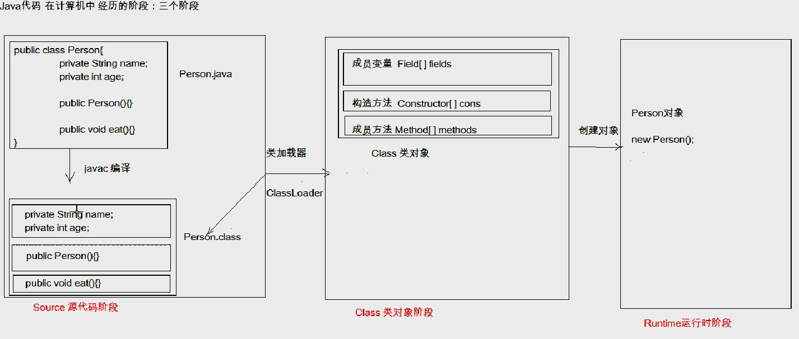

### 一、Junit

单元测试类，`@Test`注解修饰一个测试方法，`@Before`所有测试方法之前执行的代码，`@after`所有测试代码之后执行。

### 二、反射

**将类的各个组成部分封装为其他对象就叫反射机制**

java代码的三个阶段



Class类对象解释一个字节码文件，把字节码文件组成部分重新构造出对象，其包含三个对象数组分别描述成员变量、构造方法、成员方法，之后用Class类对象在内存中创建一个对象。

案例：写一个框架类，不修改代码情况下可以创建任何类的对象，执行其任何方法

```java
package cn.yyl.demo02.reflect;

import java.io.InputStream;
import java.lang.reflect.Method;
import java.util.Properties;

public class ReflectTest {
    public static void main(String[] args) throws Exception {
        Properties properties = new Properties(); //专门加载properties文件的对象 生成双列集合

        ClassLoader classLoader = ReflectTest.class.getClassLoader();
        InputStream resourceAsStream = classLoader.getResourceAsStream("pro.properties");

        properties.load(resourceAsStream); // 加载配置文件

        String className = properties.getProperty("className");  // 获取配置字段值
        String methodName = properties.getProperty("methodName");

        Class cls = Class.forName(className); // 加载该类进内存
        Object obj = cls.getConstructor().newInstance();//创建该类对象
        Method m = cls.getMethod(methodName);  // 获取Class的成员方法
        m.invoke(obj); // 执行方法

    }
}
package cn.yyl.demo02.domain;

public class Person {
    public void eat(){
        System.out.println("eat...");
    }
}
// pro.properties
className=cn.yyl.demo02.domain.Person
methodName=eat
```

### 三、注解

自定义注解：`public @interface <注解名称>{}`

注解本质是一个接口，默认继承Annotation接口。

使用注解写上述案例

```java
//期望此类创建Person类，执行eat方法
@MyAnnotation(methodClassName = "cn.yyl.demo02.domain.Person",methodMethodName = "eat")
public class ReflectTest {
    public static void main(String[] args) throws Exception {
        //解析注解，获取配置
        Class<ReflectTest> cls = ReflectTest.class;
        MyAnnotation myan = cls.getAnnotation(MyAnnotation.class);  // 获取注解对象
        String className = myan.methodClassName(); // 调用注解对象定义的抽象方法，获取返回值
        String methodName = myan.methodMethodName();

        Class cl = Class.forName(className); // 加载该类进内存
        Object obj = cl.getConstructor().newInstance();//创建该类对象
        Method m = cl.getMethod(methodName);  // 获取Class的成员方法
        m.invoke(obj); // 执行方法
    }
}


// MyAnnotation.java
import java.lang.annotation.ElementType;
import java.lang.annotation.Retention;
import java.lang.annotation.RetentionPolicy;
import java.lang.annotation.Target;

//描述需要执行的类名，和方法名
@Target({ElementType.TYPE})   // 该注解作用在类上面
@Retention(RetentionPolicy.RUNTIME)  // 该注解保留在runtime阶段
public @interface MyAnnotation {
    String methodClassName();
    String methodMethodName();
}
```

