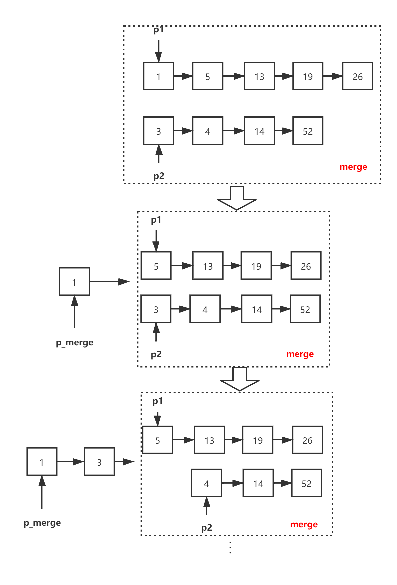

题目描述：

输入两个单调递增的链表，输出两个链表合成后的链表，当然我们需要合成后的链表满足单调不减规则。

**比较这两个链表头结点数值大小，把小的链到合成链表上。可以用普通循环或者递归实现。**

- 合并两个有序链表，其实就是返回某个头结点。把头结点值小的拿出来（p1或者p2），再把剩余的链表合并好，和拿出来的那个头结点串起来就完成递归任务了。递归基是当某个链表空了，就返回另一个链表头结点。

