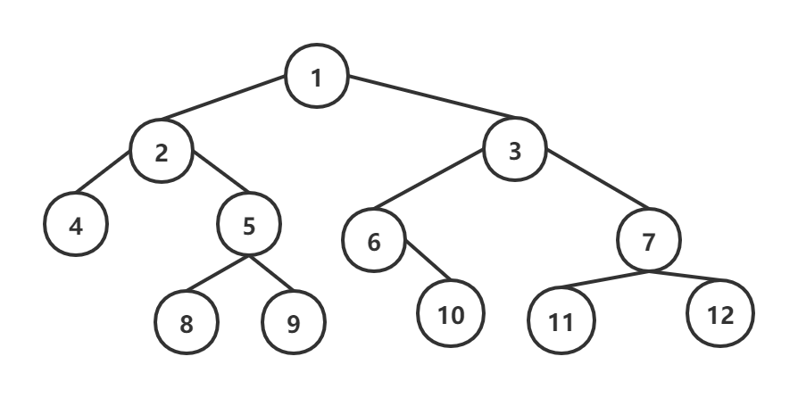
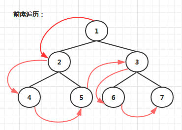
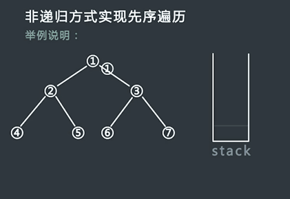
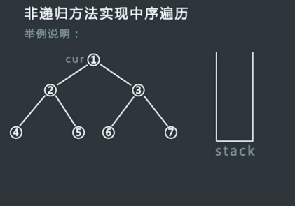

二叉树的遍历

首先需要记住两句话

1. **根节点的访问位置决定遍历方法**

2. **左永远在右的左边**，**右边永远在左边的右边**

遍历方法：

1. 深度优先：前序、中序、后序
2. 广度优先



**前序**：**1** 2 4 5 8 9 3 6 10 7 11 12

**中序**：4 2 8 5 9 **1** 6 10 3 11 7 12

**后序**：4 8 9 5 2 10 6 11 12 7 3 **1**

一、**先序**

​																


1. 第一种写法：

   **这种写法是先把左边全丢入栈，再看右边**

   ```c++
   void DLR1(TreeNode * root){ 
       if(root == NULL)
           return ;  
       TreeNode* node = root;  //记录当前结点
       stack<TreeNode*>treeStack;  //用栈来存访问过的结点，因为后面要用存储的结点来访问右子树
       //遍历整个树
       while((node != NULL) || (treeStack.empty() != true)){ //结点为空，栈为空。只要这两件事不同时发生就可以继续
           // 把左边结点放入栈
           while(node != NULL){ //这段代码负责向左 /
               printNode(*node);  //访问树结点的操作，这里定义为打印结点值
               treeStack.push(node);
               node = node -> left;
           } // 这里node一定是最左结点（相对）
           /*这里要做两件事：
           1.当前结点的右子树根节点准备丢入栈 
           2. pop()到当前结点的父结点，以便当前结点平行的右子树（即，父结点的右子树）访问完成，可以对父结点的右子树进行操作*/
           if(treeStack.empty() != true){  /*    这段代码负责向右  \                 */
               node = treeStack.top();  // note 与栈顶同步，pop之后，该栈顶会消失，如果不记录则无法获取其右子树
               node = node -> right;  //当前结点设置为右结点，准备往栈里丢
               treeStack.pop();          
           }
       }
   }
   ```

2. 第二种写法：

   **栈顶是当前结点**，**其入栈操作（打印）之后就要pop之**，**再依次压入其右子树（后访问）和左子树（先访问，位于栈顶）**

   ```c++
   void DLR2(TreeNode* root){
       TreeNode* current_node;  //记录当前栈top
       stack<TreeNode*>treeStack;
       treeStack.push(root);
       while(treeStack.empty() != true){
           current_node = treeStack.top(); // 当前结点
           printNode(*current_node);
           treeStack.pop();  //访问当前结点之后pop之
   
           if(current_node -> right != NULL){ // 先push右子树（后访问）
               treeStack.push(current_node -> right);
           }
   
           if(current_node -> left != NULL){ // 再push左子树（先访问）
               treeStack.push(current_node -> left);
           }
       }
   }
   ```

   

------

二、中序


跟先序一样，只是对结点进行操作（打印）的位置不一样

```c++
void LDR(TreeNode* root){
    TreeNode* current_node = root;
    stack<TreeNode*>treeStack;
    while((current_node != NULL) || (treeStack.empty() != true)){
        while(current_node != NULL){
            treeStack.push(current_node);
            current_node = current_node ->left;
        }
        if(treeStack.empty() != true){
            current_node = treeStack.top();
            printNode(*current_node); //这里对左边结点处理
            treeStack.pop();
            current_node = current_node -> right;
        }
    }
}
```



三、后序：

